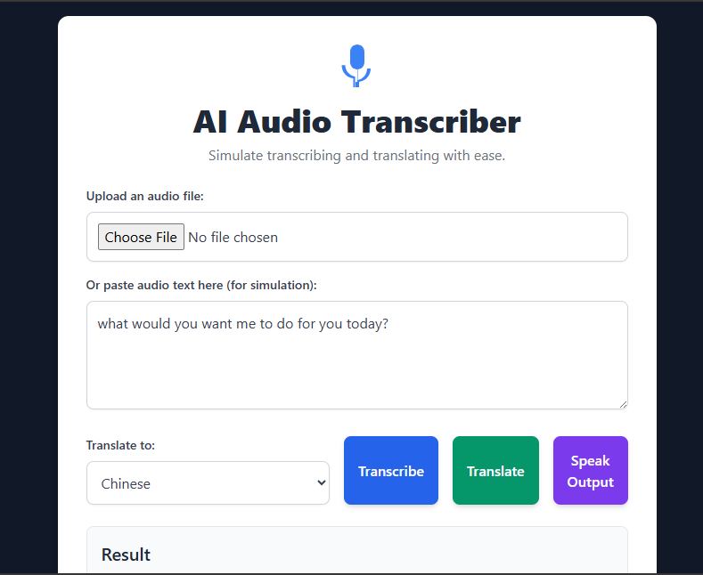

# AI Audio Transcriber & Translator


Welcome to the **AI Audio Transcriber & Translator**!  
This React application leverages the Gemini API to simulate audio transcription, translation, and text-to-speech (TTS) in a modern, user-friendly interface.

[](https://github.com/stanmouDev/MY-REACT-APP.git)

---

## ✨ Features

- **Audio File Upload**: Upload audio files (simulated, not processed yet).
- **Text Transcription**: Paste audio text and simulate transcription.
- **Translation**: Translate text into multiple languages.
- **Text-to-Speech**: Convert text output to speech using Gemini TTS.
- **Modern UI**: Built with React and styled with Tailwind CSS.

---

## 🚀 Getting Started

### 1. Clone the Repository

```sh
git clone https://github.com/stanmouDev/MY-REACT-APP.git
cd MY-REACT-APP
```

### 2. Install Dependencies

```sh
npm install
```

### 3. Set Up Environment Variables

Create a `.env` file in the **root** of your project (not in `src/`):

```
REACT_APP_GEMINI_API_KEY=your_gemini_api_key_here
```

**Note:**  
Never share or commit your API key publicly.

### 4. Start the App

```sh
npm start
```

The app will open in your default browser at [http://localhost:3000](http://localhost:3000).

---

## 🛠️ Project Structure

```
my-react-app/
├── public/
│   └── index.html
├── src/
│   ├── App.jsx
│   ├── index.js
│   └── index.css
├── .env
├── .gitignore
├── package.json
├── tailwind.config.js
├── postcss.config.js
└── README.md
```

---

## 📝 Usage

1. **Upload** an audio file (optional, for simulation).
2. **Paste** audio text in the text area.
3. **Select** a target language for translation.
4. **Transcribe** or **Translate** the text.
5. **Listen** to the output using the "Speak Output" button.

---

## 🛡️ API Key Security

- Your `.env` file is **ignored by git** (see `.gitignore`).
- Never expose your API key in public repositories.
- For production, set environment variables in your deployment platform.

---

## 📦 Deployment

You can deploy this app to platforms like Vercel, Netlify, or GitHub Pages.  
Remember to set your environment variables securely in your deployment settings.

---

## 📄 License

This project is licensed under the MIT License.

---

## 👤 Author

[stanmouDev](https://github.com/stanmouDev)

---

## ⭐️ Star this repo if you found it

